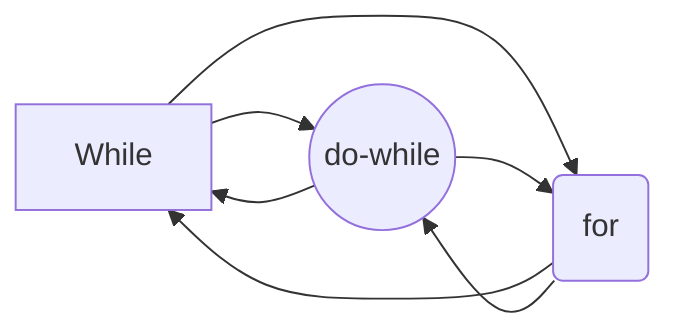

# Цикли
### Цикъл for

```c++

for(Инициализация(i)>;  <Булево условие>;  <Актуализация(i)> )  
{  
<Тяло на цикъла(i)>;  
}

 ```
### Цикъл while
```c++
while (<Булево условие>)  
{  
<Тяло на цикъла>;  
}
 ```
Изпълнението работи така:
1. Проверява се булевото условие;
	1.1  ако има стойност **лъжа**, цикълът приключва
	1.2 ако има стойност **истина**,  се изпълнава 2.
2. Изпълнява се тялото на цикъла. Отиваме на 1.

### Цикъл do- while
```c++
**do**  
{  
<Тяло на цикъла>
}while (<Булево условие>);
 ```
 Изпълнението работи така:
1. Изпълнява се тялото на цикъла.
2. Проверява се булевото условие
	2.1  ако има стойност **лъжа**, цикълът приключва
	2.2  ако има стойност **истина**,  отиваме на точка 1.

# Конвертиране на цикли.

### От for към while.
```c++
// for-loop   
for(int i = 0; i < 10; i++)  
{  
<Тяло>
}  
  
// For loop converted to while loop   
int i = 0; //Инициализация
while(i < 10)  
{  
	<Тяло>
	i++; // Актуализация
}
 ```
### От while към for.

```c++

// while loop  
while(*str != '\0')  
{ 
	<Тяло>
	++str;
}

  
// while loop converted to for loop  
for(; *str != '\0'; ++str)  
{  
	<Тяло>  
}
 ```
 ### От do-while към while.
```c++
// do-while loop
do 
{  
<Тяло>
} while (<Условие>);

// do-while loop converted to while loop  
<Тяло> 
**while**(<Условие>)  
{  
<Тяло>
}
 ```
